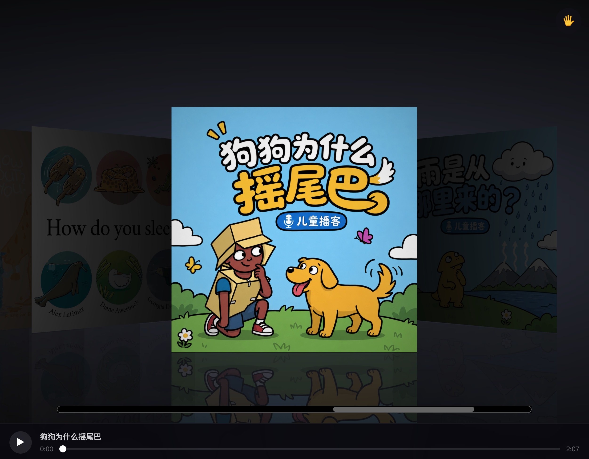
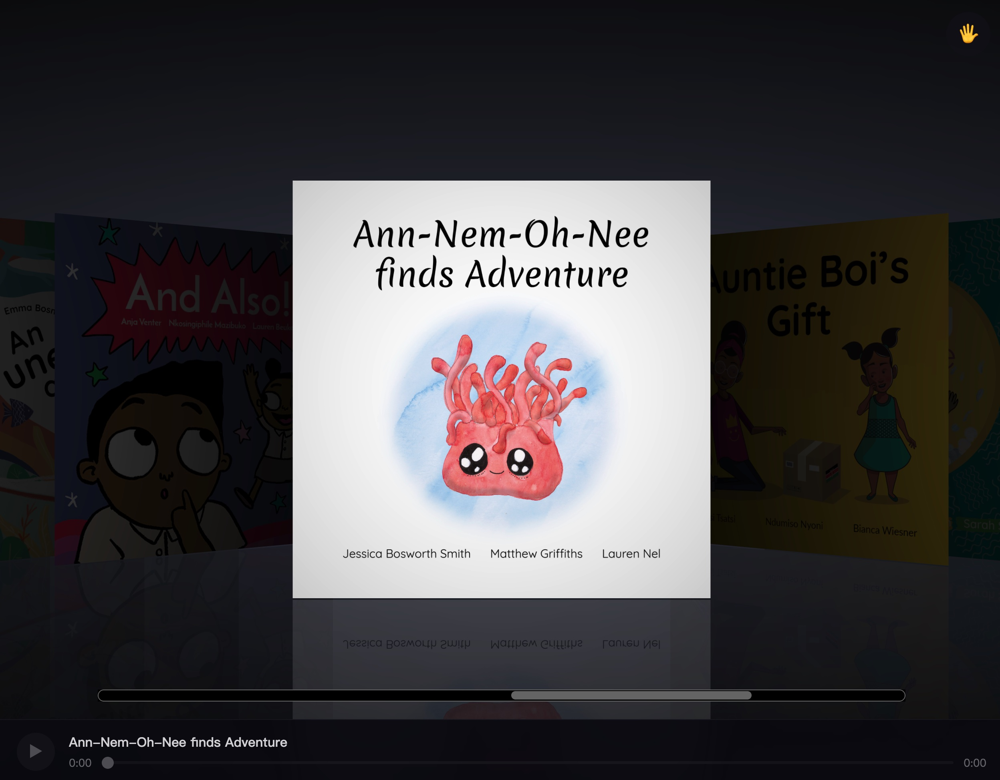
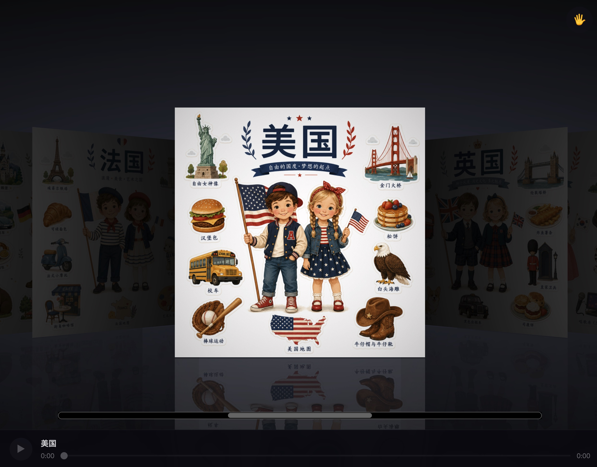

# Cover-flow

一个用 Three.js 实现的 3D coverflow 音频书架。浏览封面、播放对应音频、翻转封面阅读同步字幕，还可以选择用摄像头手势来操作整个界面。

## 截图

| 主界面 + 播放器 | 翻转前 | 切换内容 |
|---|---|---|
|  |  |  |

## 功能

- 3D coverflow 导航（Three.js + GSAP），支持拖拽 / 滚轮 / 滑块切换
- 点击封面翻转，背面显示文本内容
- 底部播放器：播放/暂停 + 进度条，随当前封面自动切换音频
- 字幕随音频播放进度逐句高亮（支持 `.srt` / `.json` 时间戳格式）
- 可选的摄像头手势控制（基于 MediaPipe，纯浏览器端运行）
- 支持部署到 Cloudflare Pages，本地也可以双击直接运行

## 目录结构

```
covers/   封面图片   Artist - Title.jpg
audio/    音频文件   Artist - Title.mp3
texts/    文本/字幕   Artist - Title.txt / .srt / .json
```

三个文件夹里同名（不含扩展名）的文件会自动关联在一起。

### 封面命名规则

`艺术家 - 标题.jpg` → 自动解析出艺术家和标题。文件名里没有 ` - ` 的话，整个文件名就作为标题。

### 文本格式（优先级：`.srt` > `.json` > `.txt`）

- **`.txt`** 纯文本，翻转后直接显示全文，无高亮
- **`.srt`** 标准字幕格式（推荐），随音频播放进度逐句高亮当前行。可以用 Aegisub、剪映、Whisper 自动转录等任意工具生成
- **`.json`** 手动标时间戳：
  ```json
  [
    { "start": 0,   "end": 4.2, "text": "第一段文字……" },
    { "start": 4.2, "end": 9.5, "text": "第二段文字……" }
  ]
  ```

## 本地运行

**方式一：双击运行**

- macOS：双击 `Start-Mac.command`
- Windows：双击 `Start-Windows.bat`

两者效果一样：自动生成 `covers.json`、启动本地服务器，并打开 `http://localhost:3000`。

**方式二：命令行**

```bash
npm start   # 等价于 node build.js && node server.js
```

无需 `npm install`，没有任何 npm 依赖；Three.js / GSAP / MediaPipe 都是通过 CDN 按需加载的。

## 手势控制

点击右上角的 🖐️ 按钮开启/关闭，开启时会请求摄像头权限。

| 手势 | 操作 |
|------|------|
| ✌️ 剪刀手 / V 字 | 翻转当前封面 |
| ✊ 握拳 | 关闭翻转 |
| 👍 大拇指朝上 | 播放音频 |
| 👎 大拇指朝下 | 暂停音频 |
| 手掌左右挥动 | 切换上一张 / 下一张封面 |

技术实现：

- 静态手势（翻转/关闭/播放/暂停）用的是 [MediaPipe Tasks Vision](https://ai.google.dev/edge/mediapipe/solutions/vision/gesture_recognizer/web_js) 的 `GestureRecognizer`，自带 7 种预训练手势分类，全部在浏览器端跑（WASM），不上传任何画面到服务器
- 左右滑动是自己写的逻辑：追踪手掌关键点的水平位置，用移动平均过滤抖动，触发后必须等手部"静止"下来才会重新允许下一次滑动，避免一次挥手触发多下

手势控制是可选的叠加层，关闭后鼠标拖拽、滚轮、点击、滑块这些原有操作完全不受影响。

## 部署到 Cloudflare Pages

- Build command: `node build.js`
- Build output directory: `/`

`server.js` 在本地运行时会动态扫描 `covers/` `audio/` `texts/` 三个文件夹；但 Cloudflare Pages 是纯静态托管，没有运行时文件系统，所以 `build.js` 会在构建阶段把这三个文件夹的内容快照成一份静态的 `covers.json`，前端优先读取这份快照，本地没有快照时再回退到 `server.js` 提供的 `/api/covers` 接口。

## 技术栈

- [Three.js](https://threejs.org/) — 3D 渲染
- [GSAP](https://greensock.com/gsap/) — 动画
- [MediaPipe Tasks Vision](https://ai.google.dev/edge/mediapipe/solutions/vision/gesture_recognizer/web_js) — 手势识别
- Node.js 内置 `http` 模块写的本地服务器，无第三方依赖

## 致谢

本项目基于 [addyosmani/threejs-coverflow](https://github.com/addyosmani/threejs-coverflow)（[在线演示](https://threejs-coverflow.addy.ie/)）二次开发——原项目用 Three.js + GSAP 实现了苹果 Cover Flow 风格的 3D 封面流效果，本仓库在此基础上扩展了本地封面/音频/字幕管理、播放器、翻转卡片、手势控制等功能。
